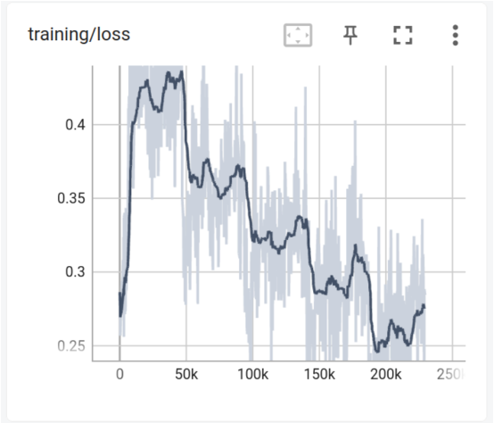

# Adaptation of a Transformer based chatbot with Emotion recognition for an Interactive Robot

## Introduction

The following repository contains the final project submission for the course ENPM 809k - Fundamentals for Artificial Intelligence and Deep Learning Framework. This was worked on as a team of 3.

## Project Members

- Jai Sharma
- Qamar Syed
- Tej Kiran Reddy 

## Abstract

In this project we use a transformer based neural network to create a chatbot pipeline to perform the following tasks:

1) understands the user emotion from text
2) generates a valid response
3) predicts an emotion score for the response

To achieve this task we will train two separate neural networks to predict user emotion and chatbot response and respective robot emotion. The AI pipeline takes in the user dialogue, predicts an user emotion and forwards the emotion and dialogue to the chatbot NN to find the response and bot’s emotion. 

The details of the project can be found in the following documents:
- [report]()
- [presentaion]()

## Chatbot Pipeline

   
   

| Emotion Recognition NN Architecture | ChatBot NN Architecture |
:-------------------------:|:-------------------------:|
|  |  | 

## Training Loss

| Emotion Recognition Training Loss| ChatBot Training Loss|
:-------------------------:|:-------------------------:|
|  |  | 

## Results

   

